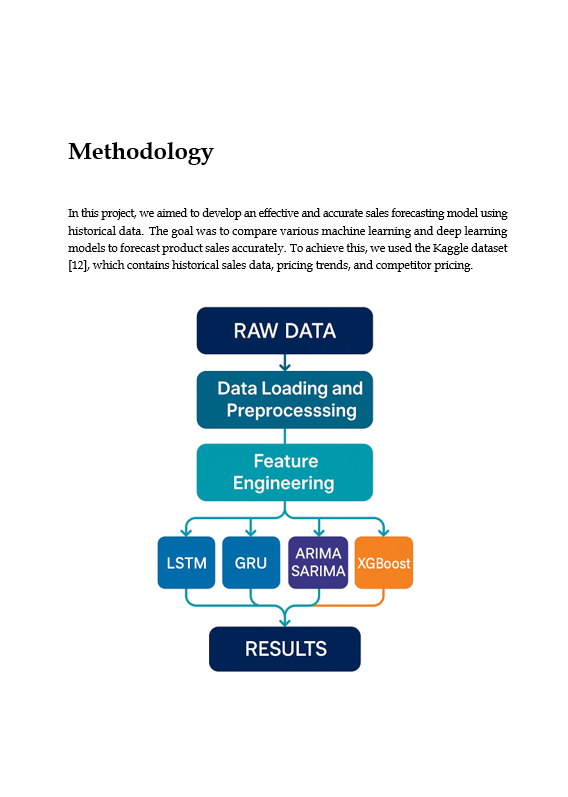
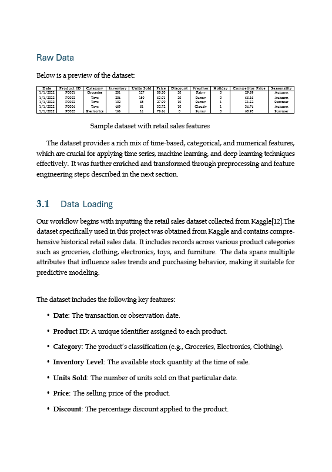
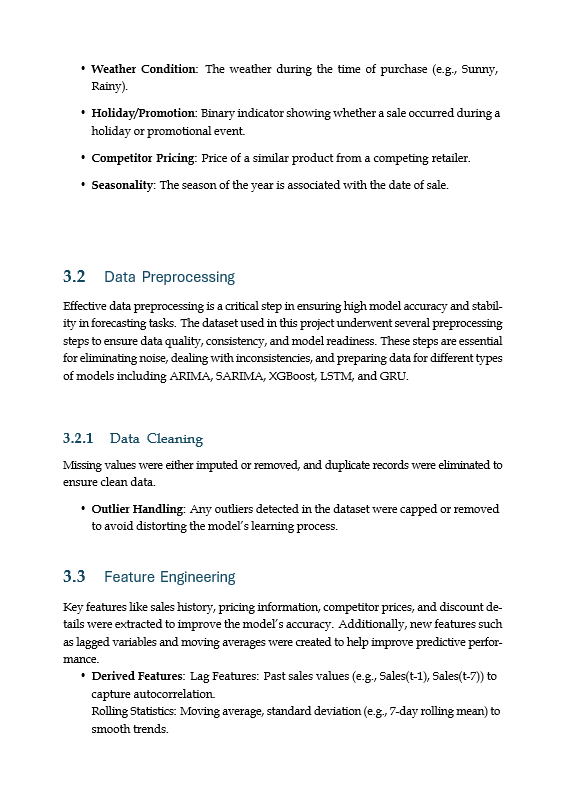
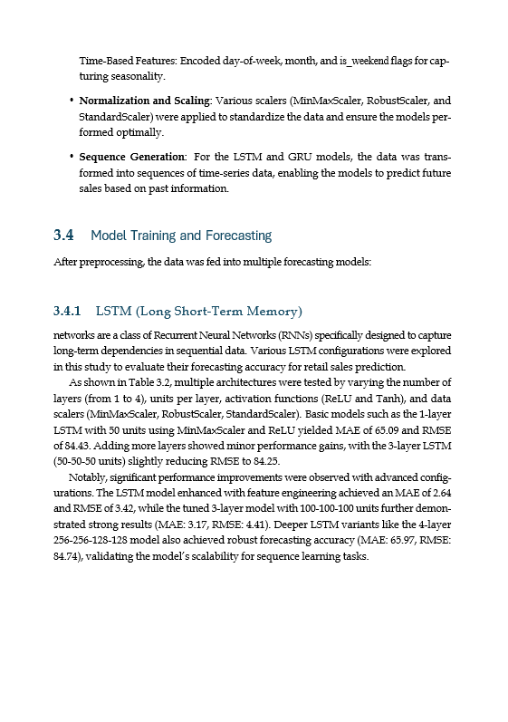
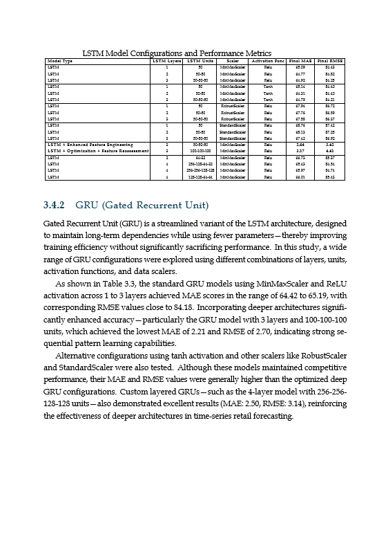
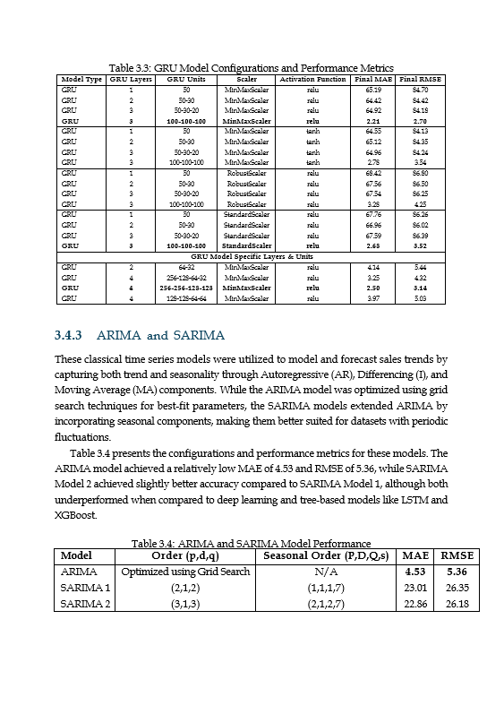
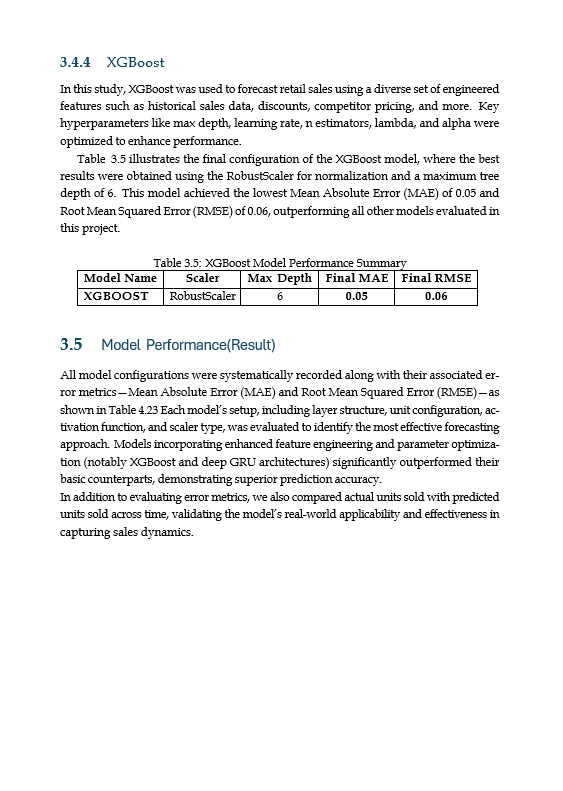
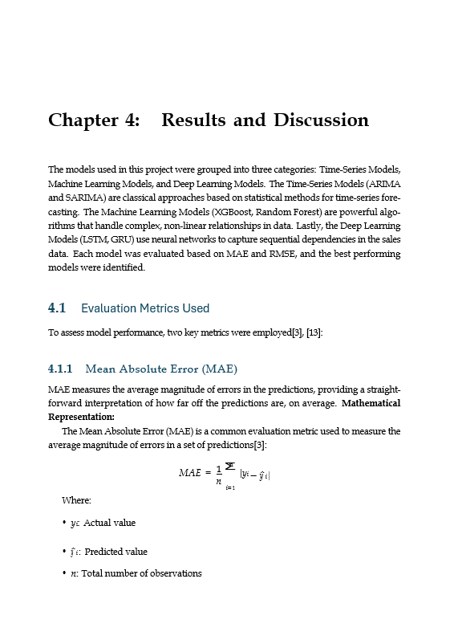
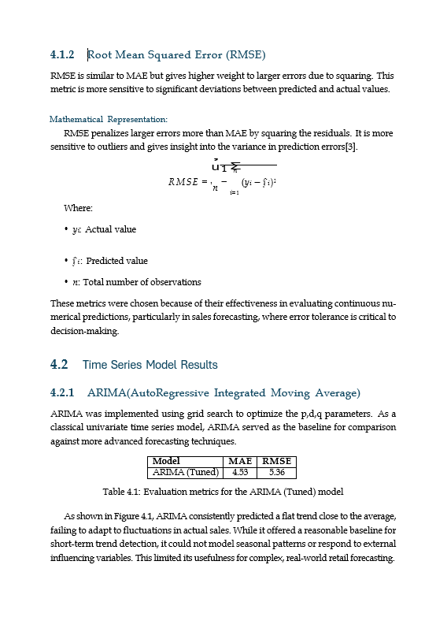
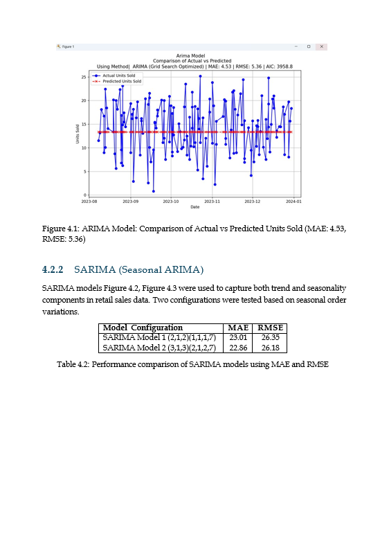

# 🛒 AI-Powered Retail Sales Forecasting

This project explores and compares several machine learning and deep learning models to forecast product-level retail sales. The goal is to identify the most effective forecasting approach using a combination of classical time series models, recurrent neural networks (LSTM & GRU), and XGBoost with extensive feature engineering.

---

## 📁 Project Structure

---

## 🧠 Models Compared

- **LSTM** (1 to 4 layers, various units, ReLU/Tanh)
- **GRU** (1 to 4 layers, tuned for depth)
- **ARIMA** (optimized via grid search)
- **SARIMA** (seasonal ARIMA with multiple seasonal orders)
- **XGBoost** (boosted tree model with tuned hyperparameters)

---

## ⚙️ Techniques Used

- Lag features (up to 14 days)
- Rolling statistics (mean, std)
- Time-based features (day, month, weekend)
- External pricing & promotion signals
- Outlier clipping using quantiles
- Robust, Standard, and MinMax Scalers
- Hyperparameter tuning using **Optuna**

---

## 🖼️ Visual Documentation

### 1. Methodology Overview

### 2. Raw Data & Sample Preview

### 3. Data Loading and Feature Summary

### 4. Data Preprocessing & Outlier Handling

### 5. Feature Engineering Techniques

### 6. Model Architectures - LSTM

### 7. Model Architectures - GRU

### 8. Classical Models - ARIMA & SARIMA

### 9. XGBoost Model & Metrics

### 10. Final Results and Conclusions

---

## 📊 Best Model Performance

| Model     | MAE  | RMSE |
|-----------|------|------|
| **XGBoost** | **0.05** | **0.06** |
| GRU (3-layer, 100-100-100) | 2.21 | 2.70 |
| LSTM (3-layer + FE) | 2.64 | 3.42 |
| ARIMA | 4.53 | 5.36 |
| SARIMA 2 | 22.86 | 26.18 |

---

## ✍️ Author

**Abu Saleh**

---

## ⭐ Acknowledgements

- Dataset: [Kaggle Retail Sales Data](https://www.kaggle.com/)
- Libraries: TensorFlow, XGBoost, Optuna, Statsmodels, Pandas, Scikit-learn

---

## 📌 Note

Only visualization and summary images are included in this repository. Scripts and code files were excluded intentionally.
